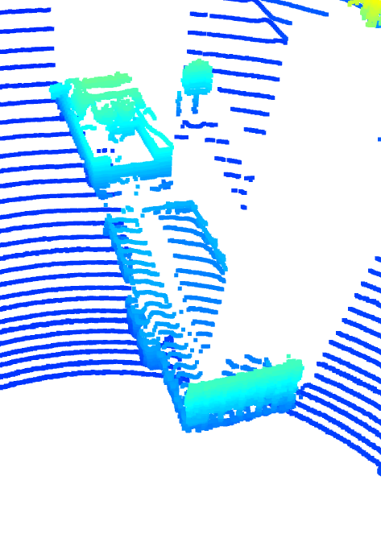
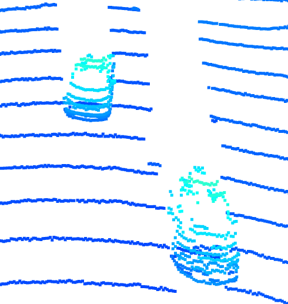
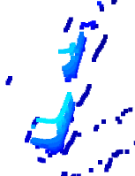
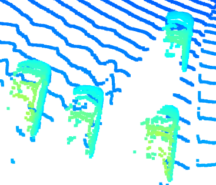
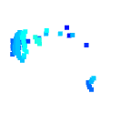
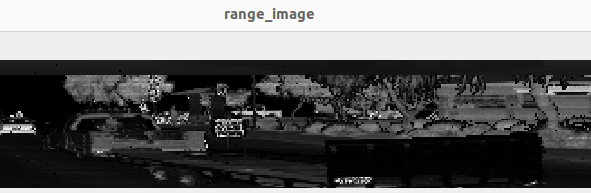
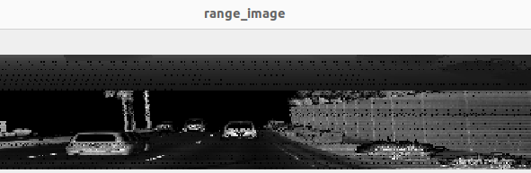
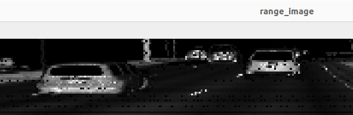
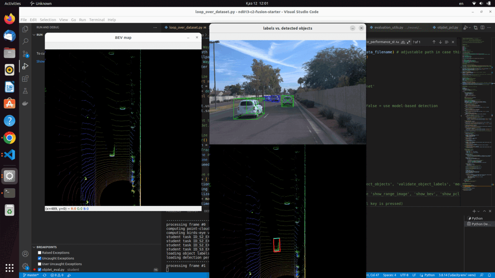
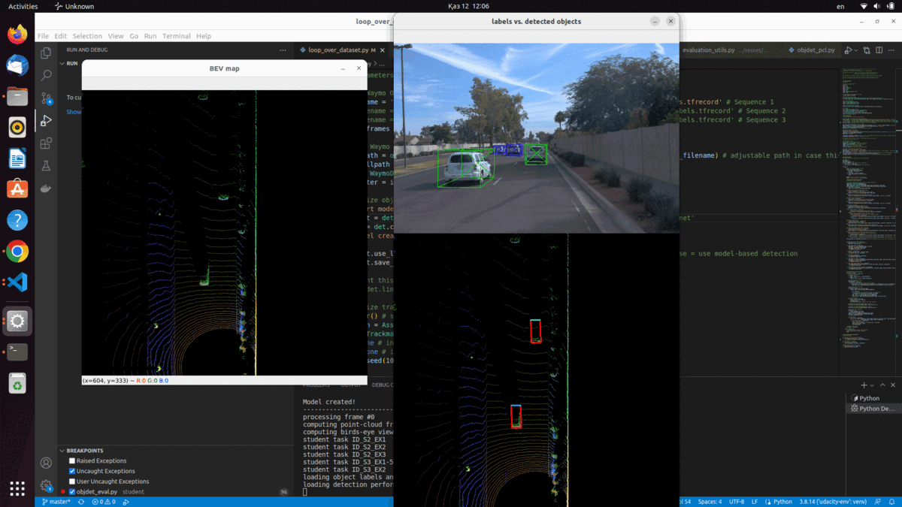

# Section 1 : Compute Lidar Point-Cloud from Range Image

## Visualize lidar point-cloud (ID_S1_EX2)
## 1. Find and display 6 examples of vehicles with varying degrees of visibility in the point-cloud
#### Examples of clearly visible vechicles on point-cloud:
#### - Clearly visible car with trunk in front of our car

#### - Clearly visible front side of car in back of our car

#### Examples of car with visible only one side:
#### - Example of car with visibe left side

#### - Exaomple of cars with visible right sides

#### Examples with hardly visible cars:
#### - Example of hardly visible car behind of our car

#### - Example of hardly visible car in front of our car

## 2. Identify vehicle features that appear as a stable feature on most vehicles (e.g. rear-bumper, tail-lights) and describe them briefly. Also, use the range image viewer from the last example to underpin your findings using the lidar intensity channel.

#### 2.1 Tail-lights clearly visible in intensity channel:

#### 2.2 Rare bumper clearly visible in intensity channel:

#### 2.3 Licence plate clearly visible in intensity channel:

Such vechicle features can be easyly identified by intensyty because of their reflective properties of the material.

## Results visualization
### Darknet detections sample:

### FPN ResNet detections sample:
